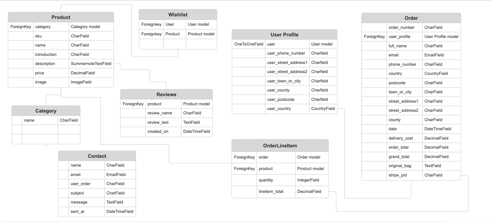

## Introduction

Link to the live site here - [Lohana](https://lohana-df1411a79e72.herokuapp.com/)

## Table of Contents:
1. [**Introduction**](#introduction)
1. [**Planning**](#planning)
    * [***User Stories***](#user-stories)
        * [***Dropped***](#dropped)
    * [***Site aims***](#site-aims)
    * [***Scope***](#scope)
        * [***Book table form***](#1-book-table-form)
        * [***User profile***](#2-user-profile)
        * [***Admin panel***](#3-admin-panel)
        * [***Navigation bar***](#4-navigation-bar)
        * [***Footer***](#5-footer)
        * [***Landing page***](#6-landing-page)
        * [***Menu***](#7-menu)
    * [***Wireframes***](#wireframes)
    * [***Database schema***](#database-schema)
    * [***Color scheme***](#color-scheme)
    * [***Typography***](#typography)
1. [**Agile**](#agile)
1. [**Features**](#Features)
    * [***Navigation***](#navigation)
        * [***Navigation - User***](#navigation---user)
        * [***Navigation - Admin***](#navigation---admin)
    * [***Landing page***](#landing-page)
    * [***Footer***](#footer)
    * [***AllAuth***](#allauth)
        * [***Register***](#register)
        * [***Login***](#login)
        * [***Logout***](#logout)
    * [***Contact form***](#booking-form)
    * [***User***](#user)
        * [***Profile***](#profile)
    * [***Admin***](#admin)
        * [***Add products***](#add-products-pagel)
    * [***Future features***](#future-features)
1. [**Deployment**](#deployment)
    * [***Cloning***](#cloning)
1. [**Testing**](#testing)
1. [**Credits**](#credits)
    * [***Technologies***](#technologies)
    * [***Code***](#code)
    * [***Content***](#content)
    * [***Media***](#media)
    * [***General reference***](#general-reference)

## Planning

### User stories

#### EPIC - View products

As a shopper I can view all site products so that I can purchase them

- Acceptance Criteria
    * Access the products from the first page or navigation bar

    * All products listed on the page

    * Products listed with price, image and rating

    * Click products for more details and to purchase

As a shopper I can view all categories of products so that I can purchase specific items based on my needs

- Acceptance Criteria
    * All categories highlighted on home page and navigation bar

    * See a list of products based on category

    * Able to identify on each product what category it is

As a shopper I can view every products details on a separate page so that I can find more information and select them to purchase

- Acceptance Criteria
    * Click on each product to view the products details

    * Product details including price, rating, description, images and sizes where applicable

    * Able to select quantity to purchase and add it to bag

As a shopper I can add a review on the products so that I can share my opinions about the products

- Acceptance Criteria
    * Able to add a review on the product details page

    * Include a name, date of review and review

    * Possible to see how many reviews exist

#### EPIC - Register and User profile

As a site user I can create an account so that I can have a personal account

- Acceptance Criteria
    * Register for an account on the site with my details

    * Receive an email confirmation after registering

    * Have a personal profile

As a site user I can login/logout out of my account so that I can access my account

- Acceptance Criteria
    * Login/logout from the navigation bar

    * Recover my password

    * Get access to my personal profile

As a site user I can access a personal user profile so that I can view my orders and personal details

- Acceptance Criteria
    * Personalized profile with delivery details, order history and wishlist

    * Update delivery details from profile

    * Able to save delivery details to my profile when checking out

    * List of user orders and link to order confirmation

As a site user I can save products to my wishlist on my profile so that I can save products that I would like to buy

- Acceptance Criteria
    * Able to save a product from the products list

    * Access the wishlist on my profile

    * List of the products I have saved

#### EPIC - Search and sort 

As a shopper I can search for products so that I can easily find what I'm looking for

- Acceptance Criteria
    * Search option in navigation bar

    * Search based on name, description or category

    * See how many products are available and what I've searched for

As a shopper I can sort the products so that I can quickly identify what I'm looking for

- Acceptance Criteria
    * Sorting option on products page

    * Sort based on name, price, rating and category

    * See how many products are available

#### EPIC - Shopping bag and checkout

As a shopper I can view my shopping bag so that I can ensure I make the correct order

- Acceptance Criteria
    * View shopping bag in navigation bar

    * See total price of the items selected on icon

    * Click shopping bag and get a full view of my items

As a shopper I can edit/delete my order in the shopping bag so that I can purchase what I want

- Acceptance Criteria
    * View all items in my shopping bag with their details

    * See total price of all items

    * Add/remove items from my bag

As a shopper I can make an order purchase so that I can buy the items I want safely

- Acceptance Criteria
    * Checkout by entering my personal details, payment information and billing details

    * See delivery information (free delivery or delivery fee)

    * Make a card transaction

    * My personal and payment information is safe and secure

As a shopper I can receive an order confirmation after checkout so that I know my order has been processed

- Acceptance Criteria
    * View an order confirmation with all my order details after checkout

    * Receive an email of my order confirmation

    * Able to contact the store if something is not correct with my order

#### EPIC - Admin management

As an admin I can edit/delete products from the site so that I have control over the store inventory

- Acceptance Criteria
    * Access product information

    * Edit product information

    * Delete products

As an admin I can add products to the site so that I can add relevant inventory

- Acceptance Criteria
    * Admin access to site with admin profile

    * Add more products to the site

    * Input images, price, description and necessary product information

#### EPIC - Contact

As a shopper I can contact the store so that I can communicate with the store about orders, products or whatever I might need to make a purchase

- Acceptance Criteria
    * Contact form on the website

    * Input details and message for the store

    * Form submission to admin panel

#### Dropped
As an admin user, I can access the menu page so that I can edit/delete menu items

- Acceptance Criteria
    * Admin access to the menu page

    * Edit menu items

    * Delete menu items

### Site aims 

### Scope

The following is a prioritized list outlining the scope of the project. These priorities were determined considering the project's limited time frame and the key features essential for its aim (MVP).

#### 1. 

* 

#### 2. 

* 

#### 3. 

* 

#### 4. 

* 

#### 5. 

* 

#### 6. 

* 

#### 7. 

* 

### Wireframes

- **Home**
---

- **Products**
---

- **Product Details**
---

- **User Profile**
---

- **Contact Form**
---

- **Contact Form Success**
---

- **Add Product**
---

- **Edit Product**
---

- **Delete Product**
---

- **Shopping Bag**
---

- **Checkout**
---

- **Checkout Success**
---

### Database schema
 I used Django's built-in User Model for the user accounts and I created three custom models for reviews, wishlist and a contact form (the rest were based off the walkthrough project Boutique Ado). 

### Color scheme
I wanted a simple and elegant color scheme to match the feel of a jewelry e-commerce website. I started by creating a unique logo and I then generated the colors from the logo on [Coolors](https://coolors.co/).

### Typography
I used two different fonts across the page:
 * Noto Serif, for most texts on the site.
 * Montserrat, for the reviews to separate them from the rest of the text on the site.

The fonts were sourced from Google Fonts.

## Business Model

## SEO
I utilized [Moz](https://moz.com/explorer) and Google to research valuable keywords for Lohana and below is the list of long-tail and short-tail keywords that I included in the meta tags.

[Keywords]()

Even though keywords relating to physical locations such as 'store', 'near me', and so on are highly searched, Lohana does not have a physical store so I opted not to use those so as to not be misleading.

I added extra titles on every page, as well as added a sitemap file and a robots.txt file to improve the SEO.

## Marketing Strategy
### Brand Identity

Identify what sets Lohana apart from other gold jewelry stores. Is it the quality of craftsmanship, unique designs, ethical sourcing, or exceptional customer service?
Craft a compelling brand story and messaging that resonates with your target audience's values and aspirations.

### Demographic

Conduct market research to understand the demographics, preferences, and purchasing behavior of your target customers. Are they primarily young professionals, fashion enthusiasts, or gift buyers?
Create detailed buyer personas to represent different segments of your audience, including their needs, motivations, and pain points.

### Competitors
Analyze your competitors' marketing strategies to identify their strengths, weaknesses, opportunities, and threats. This competitive analysis can provide valuable insights into market trends, customer preferences, and potential gaps in the market that your business can exploit.

Some of these brands were also in the top of my keyword search lists when digging into which keywords would work best for SEO.

### Unique Selling Proposition (USP)

Determine what sets your products or services apart from the competition. Your USP should clearly communicate the unique value and benefits that you offer to customers. This can help differentiate your brand and attract customers in a crowded marketplace.

### Goals

Determine specific, measurable goals for your marketing efforts. These could include increasing website traffic, improving conversion rates, growing sales revenue, or expanding brand awareness within your target market.
Your goals should be specific, measurable, achievable, relevant, and time-bound (SMART). For example, your goals might include increasing brand awareness, driving website traffic, generating leads, or boosting sales.

### Marketing 

Select the most effective marketing channels to reach and engage your target audience. This might include:
Social Media Marketing: Utilize platforms like Instagram, Facebook, and Pinterest to showcase your jewelry, share user-generated content, run targeted ads, and engage with followers.
Content Marketing: Create engaging content such as blog posts, tutorials, style guides, and videos that educate and inspire your audience while subtly promoting your products.
Email Marketing: Build and segment your email list to send personalized promotions, product recommendations, exclusive offers, and updates about new arrivals or sales.
Influencer Partnerships: Collaborate with fashion influencers, bloggers, or celebrities to showcase your jewelry to their followers and leverage their influence to increase brand visibility.
Search Engine Optimization (SEO): Optimize your website content and product listings to rank higher in search engine results pages (SERPs) and attract organic traffic from people searching for gold jewelry online.
Paid Advertising: Invest in pay-per-click (PPC) advertising on platforms like Google Ads or social media channels to target specific keywords, demographics, or interests and drive relevant traffic to your website.
Execute your marketing tactics effectively across chosen channels. This may involve creating and scheduling social media posts, launching email campaigns, optimizing your website for search engines, running online ads, attending industry events, and other activities.

[Facebook profile](docs/fb-profile.png)
[Facebook profile](docs/fb-profile1.png)

### Content 

Develop visually appealing and high-quality content that showcases your gold jewelry in the best light. Use professional product photography, lifestyle images, and videos to highlight the craftsmanship, details, and versatility of your pieces.
Tell stories behind your jewelry designs, share customer testimonials and reviews, and provide styling tips or care instructions to enhance the value proposition and build trust with your audience.

## Agile

Throughout the project, I followed the Agile methodology by using GitHub projects and issues. This allowed me to organize the project's tasks into epics and user stories, making it easy to manage them on the Kanban board. This helped break down the work into smaller parts, making development smoother and more efficient.
By utilizing issues in GitHub and MSCW (MoSCoW Prioritization), I was also able to label and categorize the tasks to stay focused on the MVP. The "Won't Have's" of this project are still present on the Kanban board for future development.

I decided not to use sprints in this project due to it being more of a team logic and it made more sense for me to work in a task-based manner.
Even though I worked on this project alone, using Agile principles helped me track progress effectively and ensure future maintenance.

## Features 
### Navigation
- 

#### Navigation - User
- 

#### Navigation - Admin
- 

### Landing page
-

### Footer
- 

### AllAuth

#### Register

#### Login

#### Logout

### Products
- 

### Product Details
- 

### Contact Form

- 'POST' contact form for all shoppers to contact the store.
- All messages displayed in the admin panel.

### Contact Form Success

- 

### User - Profile Delivery Details

- User profile only accessible by the logged in user.
- Three tabs for each section of the page.
- Delivery details tab with the user's saved delivery details and a form to update the details.
- Order history tab displaying all previous orders and ability to click on the order number to go back to the checkout success page.
- Wishlist tab displaying all the user's saved products (with a link back to 'All products', a product count of all wishlist items and the sort box) and ability to remove them. 
(I purposely didn't add the wishlist to the admin panel since it's not meant to be accessed/customized by the admin)

### User - Profile Order History

### User - Profile Wishlist

### Admin - Add Products
- 

### Admin - Edit Products
- 

### Admin - Delete Products
- 

### Shopping Bag
- 

### Checkout
- 

### Checkout Success
- 

### Messages 

I created toasts (as taught from the Boutique Ado walkthrough project) to display all the messages across the site, except the wishlist messages. Those messages did not display properly and I did not have enough time to dig into why but that would be one of the first things I would fix when I come back to this project to make sure all messages on the site are cohesive in style (I mentioned this in the [TESTING.md](TESTING.md) documentation in the 'Unfixed bugs' section as well).

I've added comprehensive messages to all app views to make sure the user is kept informed of all actions.

### Future features

- Wishlist button on the Products Detail page, this was something I started implementing on this project but had to abandon due to the time I had left until the deadline. 
I instead focused on making sure the button was functional and displayed on the Products page and Profile page (where the wishlist is displayed), which I decided was the better choice for the site so the user could quickly add the product to their wishlist from the products list instead of having to make another click to the Product Details page.
- An About page with more information about the store (admin access to customize the page).
- Edit/delete account on user profile page.

## Deployment

To deploy the site to Heroku, I went through below steps: 
- Go to [Heroku](https://heroku.com/) and log into your account.
- Click "Create new app" on the front page.
- Give your app a name.
- Choose your region and click "Create app".
- You're then taken to the dashboard of your app where you have a navigation bar. Click on the Settings tab and scroll down to "Config Vars".
- Click "Reveal Config Vars" and input any necessary environment variables. In my case due to the use of below [technologies](#technologies), I added my database URL, Cloudinary URL, Gmail details, Stripe keys (including webhook) and project secret key.
- Go back to the navigation bar and select "Deploy".
- Scroll down to the "Connect to GitHub" section and click on the Connect button.
- After allowing Heroku access to GitHub, the "Connect to GitHub" section will allow you to search for the repository you wish to connect.
- Find your repository and click "Connect".
- You can now choose automatic deploys (Heroku deploys your app after every GitHub push you make) or manual deploys.
- After choosing a deployment method, click the deploy button and make sure you deploy from the correct branch.

Live link to the site - [Lohana](https://lohana-df1411a79e72.herokuapp.com/)

### Cloning

I used the cloning method to use the VSCode desktop IDE with GitHub, below are the steps I took:
- Generate a repository and click the Code button in the middle of the screen.
- Go to Local and under Clone, copy the Git repository URL on the HTTPS tab.
- Go to the VSCode IDE front page and click 'Clone Git Repository' under Start or go to the Source Control button on the left-hand side menu bar and click 'Clone Repository'.
- Input the URL in the URL tab at the top of the window and press Enter.
- Select the location/folder where you want to store your repository on your computer through the popup and click the 'Select Repository location' button.
- VSCode will now clone the repository and you can choose to open it in your current window or in a new window.

## Testing
All the testing for this project can be found in a separate document [here](TESTING.md).

## Credits 
### Technologies

- The packages installed for this project can be found in [the requirements.txt](requirements.txt).
- Django was used as the Python framework.
- HTML/CSS for the templates and styling.
- JavaScript/JQuery to manipulate the DOM.
- Bootstrap 4.4 (as used in the Boutique Ado walkthrough to simplify utilizing that code) to simplify the styling.
- Django AllAuth was used for the user authentication and register, sign-up and login tasks.
- ElephantSQL was used for the database during development and in deployment.
- Bootstrap 5.3.2 was used to style HTML and CSS.
- Cloudinary was used for media file storage.
- Whitenoise was used to serve static files.
- Stripe for handling payments.

### Code 

- I drew help from the walk-through of the Boutique Ado project. There is directly copied code from the project, as well as similarities in some of the code but I adapted it to fit the aims of this project as much as possible.

Below are links that helped me adapt/build certain features:
- [How To Create a Scroll Back To Top Button](https://www.w3schools.com/howto/howto_js_scroll_to_top.asp)
- [Navs](https://getbootstrap.com/docs/4.6/components/navs/#tabs)
- [Wishlist](https://www.youtube.com/watch?v=kD2vWOZFFcw&ab_channel=SharmaCoder)

### Content 

- The wireframes were created with Balsamiq.
- The ERD diagram was created with [Smartdraw](https://www.smartdraw.com/entity-relationship-diagram/er-diagram-tool.htm).
- Fonts were acquired from [Google Fonts](https://fonts.google.com/).
- The icons were taken from [Font Awesome](https://fontawesome.com/).

### Media

- The products, product images and product details were all taken from [Gorjana](https://www.gorjana.com/).
- The hero image was acquired from [Unsplash](https://unsplash.com/).
- The color palette was generated with the logo on [Coolors](https://coolors.co/).
- [Am I Responsive](https://ui.dev/amiresponsive) was used to generate the initial image of the ReadME to showcase how the site looks on different screens.

### General references

- [W3Schools](https://www.w3schools.com/)
- [Stack Overflow](https://stackoverflow.com/)
- [Geeks for Geeks](https://www.geeksforgeeks.org/)
- [Bootstrap Documentation](https://getbootstrap.com/)
- [Django Documentation](https://docs.djangoproject.com/en/3.2/)
- [Youtube](https://www.youtube.com/)