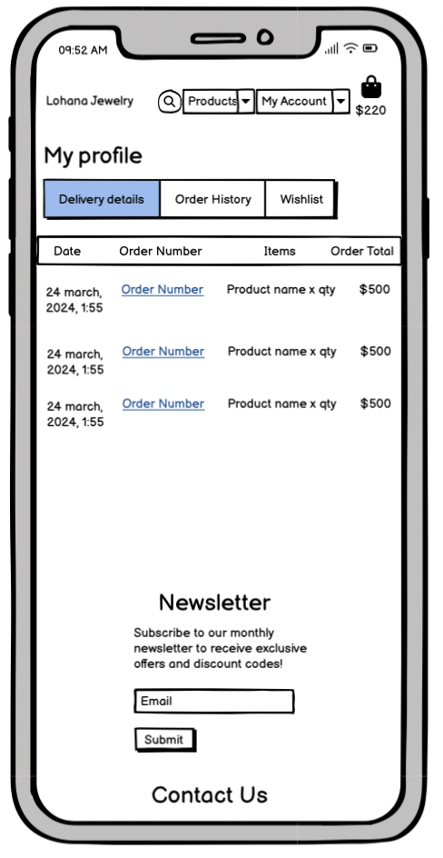
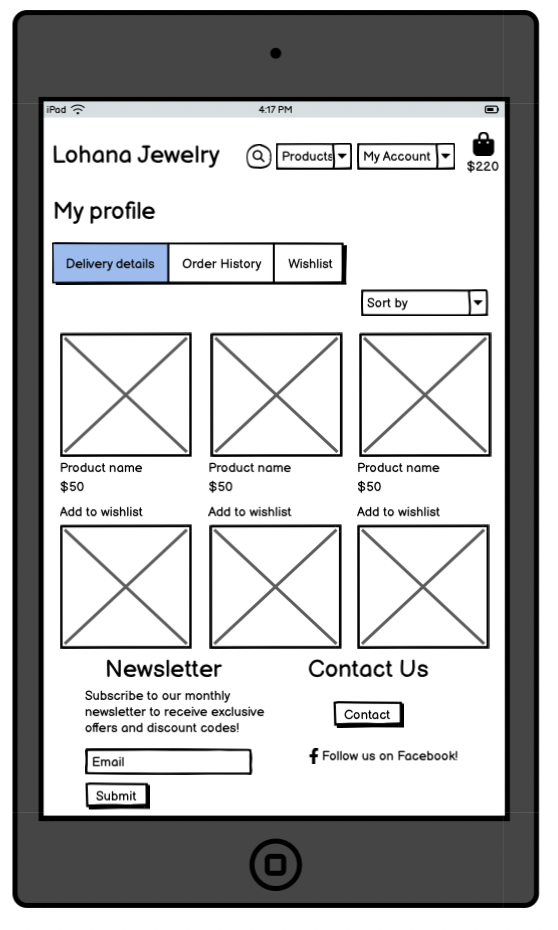
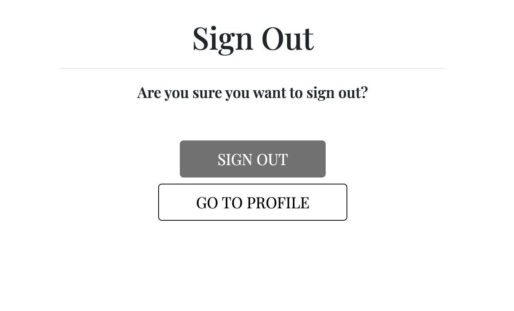

## Introduction

Lohana Jewelry is your premier destination for exquisite gold-plated jewelry online.

Jewelry is more than just an accessory; it's an expression of love, style, and personality. Whether you're celebrating a special someone, expressing your individuality, or simply treating yourself to something beautiful, we're here to help you find the perfect piece that resonates with you.

Our primary aim is to provide customers with a seamless and enjoyable shopping experience while offering a diverse selection of high-quality gold-plated jewelry pieces. 

Link to the live site here - [Lohana](https://lohana-df1411a79e72.herokuapp.com/)

## Table of Contents:
1. [**Introduction**](#introduction)
1. [**Planning**](#planning)
    * [***User Stories***](#user-stories)
        * [***EPIC - View Products***](#epic---view-products)
        * [***EPIC - Register and User Profile***](#epic---register-and-user-profile)
        * [***EPIC - Search and Sort***](#epic---search-and-sort)
        * [***EPIC - Shopping bag and Checkout***](#epic---shopping-bag-and-checkout)
        * [***EPIC - Admin Management***](#epic---admin-management)
        * [***EPIC - Contact***](#epic---contact)
    * [***Site aims***](#site-aims)
    * [***Scope***](#scope)
        * [***Objectives***](#objectives)
        * [***Deliverables***](#deliverables)
    * [***Wireframes***](#wireframes)
        * [***Landing page***](#landing-page-1)
        * [***Products***](#products-1)
        * [***Product Details***](#product-details-1)
        * [***User Profile - Delivery Details***](#user-profile---delivery-details)
        * [***User Profile - Order History***](#user-profile---order-history)
        * [***User Profile - Wishlist***](#user-profile---wishlist)
        * [***Admin - Add Product***](#admin---add-products)
        * [***Admin - Edit Product***](#admin---delete-products)
        * [***Admin - Delete Product***](#admin---edit-products)
        * [***Contact Form***](#contact-form-1)
        * [***Contact Form Success***](#contact-form-success-1)
        * [***Shopping bag***](#shopping-bag-1)
        * [***Checkout***](#checkout-1)
        * [***Checkout Success***](#checkout-success-1)
    * [***Database schema***](#database-schema)
    * [***Color scheme***](#color-scheme)
    * [***Typography***](#typography)
1. [**Business-to-Consumer (B2C) business model**](#business-to-consumer-b2c-business-model)
1. [**SEO**](#seo)
1. [**Marketing Strategy**](#marketing-strategy)
    * [***Brand Identity***](#brand-identity)
    * [***Demographic***](#demographic)
    * [***Competitors***](#competitors)
    * [***Marketing Goals***](#marketing-goals)
    * [***Marketing***](#marketing)
1. [**Agile**](#agile)
1. [**Features**](#Features)
    * [***Navigation***](#navigation)
        * [***Navigation - User***](#navigation---user)
        * [***Navigation - Admin***](#navigation---admin)
    * [***Landing page***](#landing-page)
    * [***Footer***](#footer)
    * [***AllAuth***](#allauth)
        * [***Register***](#register)
        * [***Login***](#login)
        * [***Logout***](#logout)
    * [***Products***](#products)
    * [***Product Details***](#product-details)
    * [***Contact Form***](#contact-form)
    * [***Contact Form Success***](#contact-form-success)
    * [***User Profile - Delivery Details***](#user-profile---delivery-details-1)
    * [***User Profile - Order History***](#user-profile---order-history-1)
    * [***User Profile - Wishlist***](#user-profile---wishlist-1t)
    * [***Admin - Add Product***](#admin---add-products)
    * [***Admin - Edit Product***](#admin---edit-products)
    * [***Admin - Delete Product***](#admin---delete-products)
    * [***Shopping bag***](#shopping-bag)
    * [***Checkout***](#checkout)
    * [***Checkout Success***](#checkout-success)
    * [***Messages***](#messages)
    * [***Future features***](#future-features)
1. [**Deployment**](#deployment)
    * [***Cloning***](#cloning)
1. [**Testing**](#testing)
1. [**Credits**](#credits)
    * [***Technologies***](#technologies)
    * [***Code***](#code)
    * [***Content***](#content)
    * [***Media***](#media)
    * [***General reference***](#general-reference)

## Planning

### User stories

#### EPIC - View products

As a shopper I can view all site products so that I can purchase them

- Acceptance Criteria
    * Access the products from the first page or navigation bar

    * All products listed on the page

    * Products listed with price, image and rating

    * Click products for more details and to purchase

As a shopper I can view all categories of products so that I can purchase specific items based on my needs

- Acceptance Criteria
    * All categories highlighted on home page and navigation bar

    * See a list of products based on category

    * Able to identify on each product what category it is

As a shopper I can view every products details on a separate page so that I can find more information and select them to purchase

- Acceptance Criteria
    * Click on each product to view the products details

    * Product details including price, rating, description, images and sizes where applicable

    * Able to select quantity to purchase and add it to bag

As a shopper I can add a review on the products so that I can share my opinions about the products

- Acceptance Criteria
    * Able to add a review on the product details page

    * Include a name, date of review and review

    * Possible to see how many reviews exist

#### EPIC - Register and User profile

As a site user I can create an account so that I can have a personal account

- Acceptance Criteria
    * Register for an account on the site with my details

    * Receive an email confirmation after registering

    * Have a personal profile

As a site user I can login/logout out of my account so that I can access my account

- Acceptance Criteria
    * Login/logout from the navigation bar

    * Recover my password

    * Get access to my personal profile

As a site user I can access a personal user profile so that I can view my orders and personal details

- Acceptance Criteria
    * Personalized profile with delivery details, order history and wishlist

    * Update delivery details from profile

    * Able to save delivery details to my profile when checking out

    * List of user orders and link to order confirmation

As a site user I can save products to my wishlist on my profile so that I can save products that I would like to buy

- Acceptance Criteria
    * Able to save a product from the products list

    * Access the wishlist on my profile

    * List of the products I have saved

#### EPIC - Search and sort 

As a shopper I can search for products so that I can easily find what I'm looking for

- Acceptance Criteria
    * Search option in navigation bar

    * Search based on name, description or category

    * See how many products are available and what I've searched for

As a shopper I can sort the products so that I can quickly identify what I'm looking for

- Acceptance Criteria
    * Sorting option on products page

    * Sort based on name, price, rating and category

    * See how many products are available

#### EPIC - Shopping bag and checkout

As a shopper I can view my shopping bag so that I can ensure I make the correct order

- Acceptance Criteria
    * View shopping bag in navigation bar

    * See total price of the items selected on icon

    * Click shopping bag and get a full view of my items

As a shopper I can edit/delete my order in the shopping bag so that I can purchase what I want

- Acceptance Criteria
    * View all items in my shopping bag with their details

    * See total price of all items

    * Add/remove items from my bag

As a shopper I can make an order purchase so that I can buy the items I want safely

- Acceptance Criteria
    * Checkout by entering my personal details, payment information and billing details

    * See delivery information (free delivery or delivery fee)

    * Make a card transaction

    * My personal and payment information is safe and secure

As a shopper I can receive an order confirmation after checkout so that I know my order has been processed

- Acceptance Criteria
    * View an order confirmation with all my order details after checkout

    * Receive an email of my order confirmation

    * Able to contact the store if something is not correct with my order

#### EPIC - Admin management

As an admin I can edit/delete products from the site so that I have control over the store inventory

- Acceptance Criteria
    * Access product information

    * Edit product information

    * Delete products

As an admin I can add products to the site so that I can add relevant inventory

- Acceptance Criteria
    * Admin access to site with admin profile

    * Add more products to the site

    * Input images, price, description and necessary product information

#### EPIC - Contact

As a shopper I can contact the store so that I can communicate with the store about orders, products or whatever I might need to make a purchase

- Acceptance Criteria
    * Contact form on the website

    * Input details and message for the store

    * Form submission to admin panel

### Site aims 

Highlight Collections: Highlight the thoughtfully selected collection of gold-plated jewelry, ranging from timeless classics to trendy designs, catering to various tastes and preferences.

Marketing aims:
- Expand brand awareness.
- Increase website traffic.
- Improve conversion rates.
- Grow sales revenue.

Customer Satisfaction: We strive to exceed our customers' expectations by providing exceptional service, prompt assistance, and hassle-free shopping from browsing to checkout.

User-Friendly Experience: We aim to create a user-friendly website that is easy to navigate, visually appealing, and optimized for both desktop and mobile devices. 

### Scope

#### Objectives:

- Establish online presence through a user-friendly e-commerce website to showcasing Lohana's collection of gold-plated jewelry.
- Enhance customer experience by creating a seamless shopping experience for customers from start to finish.
- Increase online sales and revenue by attracting new customers and retaining existing ones.

#### Deliverables:

- Develop a visually appealing e-commerce website for Lohana, featuring easy navigation, product displays, and seamless checkout.
- Showcase Lohana's collection of jewelry, including detailed product descriptions, high-quality images, and pricing details
- Implement user account functionality, allowing customers to register, log in, and manage their profiles, addresses, and order history.
- Integrate a shopping bag system that enables customers to add products, review their selections, and complete purchases securely through a streamlined checkout process.
- Implement admin management functionality, allowing staff to edit/delete and, add products to the website. 

### Wireframes

#### Landing Page
---

#### Products
---

#### Product Details
---

#### User Profile - Delivery Details
---

#### User Profile - Order History
---

#### User Profile - Wishlist
---

#### Admin - Add Product/Edit Product
---

#### Contact Form
---

#### Shopping Bag

I did not manage to have time to do this one!

---

#### Checkout

I did not manage to have time to do this one!

---

#### Checkout Success

I did not manage to have time to do this one!

---

### Database schema
I used Django's built-in User Model for the user accounts and created three custom models for reviews, a wishlist and a contact form (the rest were based off the walkthrough project Boutique Ado). 

### Color scheme
I wanted a simple and elegant color scheme to match the identity of Lohana and their products.
I started by creating a unique logo and then generating the website colors from the logo on [Coolors](https://coolors.co/).

### Typography
I used two different fonts across the page:
 * Noto Serif, used site-wide.
 * Montserrat, for the reviews to separate them from the rest of the text on the site.

The fonts were sourced from Google Fonts.

## Business-to-Consumer (B2C) Business Model

* **Value Proposition:**

High-quality, thoughtfully designed jewelry pieces.
14k-18k gold plated unique designs.
Secure and convenient online shopping experience.

* **Customer Segments:**

Fashion-conscious individuals seeking elegant accessories.
Gift shoppers looking for special occasions like birthdays, anniversaries, and holidays.

* **Channels:**

E-commerce Website: A user-friendly website with easy navigation and secure payment options.
Social Media Platforms: Utilize platforms like Instagram, Facebook, and Tik Tok for showcasing products, engaging with customers, and running targeted ads.
Influencer Collaborations: Partner with fashion influencers and bloggers for product endorsements and promotions.

* **Customer Relationships:**

Personalized Customer Support: Provide responsive customer service through a contact form on the website and, email.
Engaging Content: Regularly update the website and social media platforms with engaging content such as style tips, behind-the-scenes stories, product content and, customer testimonials.

* **Revenue Streams:**

Product Sales: Revenue generated from the sale of jewelry items, including earrings, necklaces, and bracelets, with future aims to release further collections such as Silver Jewelry and rings to increase revenue.

* **Key Activities:**

Inventory Management: Monitor and manage inventory levels to ensure stock availability and minimize overstock or stockouts.
Digital Marketing: Develop and execute digital marketing campaigns to drive website traffic, increase brand visibility, and acquire new customers.

* **Cost Structure:**

Product Costs: Expenses associated with sourcing raw materials, production, and labor for manufacturing jewelry items.
Marketing and Advertising: Costs related to digital marketing campaigns, social media advertising, and influencer collaborations.
Website Maintenance: Expenses for website hosting, domain registration, and ongoing maintenance and updates.
Operational Costs: Overhead expenses including salaries, and administrative costs.

* **Metrics:**

Sales Revenue: Track total sales revenue and average order value.
Website Traffic: Monitor website traffic metrics such as unique visitors, page views, and bounce rates.
Conversion Rate: Measure the percentage of website visitors who make a purchase or complete a desired action.
Customer Satisfaction: Gather feedback from customers through surveys, and reviews to assess overall satisfaction and identify areas for improvement.

## SEO
I utilized [Moz](https://moz.com/explorer) and Google to research valuable keywords for Lohana and below is the list of long-tail and short-tail keywords that was included in the meta tags.

- jewelry, accessories, necklaces, earrings, bracelets

- gold jewelry, women's jewelry, fine jewelry, jewelry brand, hoop earrings, jewelry set

- online jewelry store, jewelry for women, gift ideas for jewelry, christmas gift ideas, gifts for mom, 18k gold-plated jewelry, 14k gold-plated jewelry, gold-plated jewelry for women

Even though keywords relating to physical locations such as 'store', 'near me', and so on, are highly searched, Lohana does not have a physical store so I opted not to use those to make sure the site is not misleading.

I added extra titles on every page, as well as a [sitemap file](sitemap.xml) and a [robots.txt](robots.txt) file to improve the SEO.

## Marketing Strategy
### Brand Identity

Lohana's brand identity lies in the commitment to creating high quality elegant jewelry that complements every aspect of an individual's life. From dainty layering pieces to statement-making designs, Lohana offers a variety of accessories that empower individuals to express their uniqueness and style with confidence.

### Demographic

Age: Primarily millennials and Gen Z individuals, ranging from 25-40.

Gender: Designed to appeal to all genders, but marketing efforts are predominantly towards women, given the focus on elegant and feminine designs.

Income Level: Middle to upper-middle-class individuals with an income for luxury accessories. Lohana's price points are more accessible to consumers within this income bracket.

Lifestyle: Urban professionals, creative professionals, fashion-forward students, and individuals who appreciate elegant style in their accessories.

### Competitors
I utilized [Moz](https://moz.com/explorer) to compile a list of Lohana's top competitors in the US.

[Competitors](docs/competitors.png)

During my research into effective SEO keywords, I found that several of these competitor brands appeared at the top of my search lists.

### Marketing Goals

- Expand brand awareness.
- Increase website traffic.
- Improve conversion rates.
- Grow sales revenue.

### Marketing 

- Social Media Marketing: Use Instagram, Facebook and, TikTok to showcase jewelry, share user-generated content (reviews/testimonials), run targeted ads, and engage with followers.
- Content Marketing: Create visually appealing content such as style guides, behind-the-scenes stories and, videos that highlight Lohana's products. 
- Email Marketing: Build email newsletter list to launche email campaigns and send personalized product recommendations, exclusive offers, and updates about new arrivals and bestsellers.
- Influencer Partnerships: Collaborate with fashion influencers and bloggers to showcase Lohana's jewelry to increase brand visibility.
- SEO: Optimize website content to rank higher in SERPs and attract organic traffic from people searching for gold-plated jewelry online and gift ideas.
- Paid Advertising: Invest in Facebook ads (and Google ads where cost-efficient) to target specific keywords, demographics, and interests to drive relevant traffic to the website.

[Facebook profile](docs/fb-profile.png)
[Facebook profile](docs/fb-profile1.png)

## Agile

Throughout the project, I followed the Agile methodology by using GitHub projects and issues. This allowed me to organize the project's tasks into epics and user stories, making it easy to manage them on the Kanban board. This helped break down the work into smaller parts, making development smoother and more efficient.
By utilizing issues in GitHub and MSCW (MoSCoW Prioritization), I was able to label and categorize the tasks to stay focused on the MVP.

I decided not to use sprints in this project due to it being more of a team logic and it made more sense for me to work in a task-based manner.
Even though I worked on this project alone, using Agile principles helped me track progress effectively and ensure future maintenance.

## Features 
### Navigation

- Free delivery banner in the same color as logo text
- Lohana Jewelry logo (designed for this project) matching with the color scheme
- Functioning Search dropdown
- Products dropdown with categories and all products links
- My account dropdown with register, sign in and contact us pages
- Shopping bag icon and price. Amount updates as you add products to shopping bag

#### Navigation - User

- My account dropdown only accessible to the logged in user
- My profile access with personalized profile

#### Navigation - Admin

- My account dropdown only accessible to the admin
- Link to Add product page

### Landing page

- Simple landing page with a hero image and text to reflect the identity of the brand
- Button that links to the products page

### Footer

- Footer with a mailchimp email signup form for newsletter marketing
- Success message after subscribing
- Contact us section with a button to the contact form
- Link to Lohana's facebook page
- Privacy policy document link

### AllAuth

#### Register

#### Sign In

#### Sign Out

### Products

- Products page displaying all products or customizable by category by clicking category buttons under title 
- Also able to sort products with sort box based on name, price and category
- All products text link with product count on each page (this also displays the search term if coming from search dropdown)
- Each product containing an image, name, introduction, price and category tag (clickable tag to get to all products in that category)
- Back to top button displays after scrolling down

### Product Details

- Details page consisting of product name, image, price, category tag (clickable tag to get to all products in that category), introduction, quantity input, add to bag/continue shopping buttons, detailed description and reviews section
- Quantity input buttons disables at 1 and 99 due to min/max quantity able to be added
- Error form message if user tries to add more than 1-99 quantity
- Reviews display with name, review and time of entry
- Review container is scrollable to not take up to much space on the page
- Reviews can be edited/deleted in the admin panel

### Contact Form

- 'POST' contact form for all shoppers to contact the store
- All messages displayed in the admin panel and can be edited/deleted

### Contact Form Success

- Simple success template with a button to all products

### User Profile - Delivery Details

- User profile only accessible by the logged in user
- Three tabs for each section of the page
- Displaying user's delivery details from either checkout (save info button) or if they've added them themselves in the form
- Pre-populated form to update the details

### User Profile - Order History

- User profile only accessible by the logged in user.
- Three tabs for each section of the page.
- Order history displaying all previous user's orders with date of order, order number, items (with quantity) and grand total
- Ability to click on the order number to go back to the checkout success page with an updated info message (see [messages](#messages))

### User Profile - Wishlist

- User profile only accessible by the logged in user.
- Three tabs for each section of the page.
- Wishlist displaying all the user's saved products like they are displayed on the products page
- Text link back to 'All products' and a product count of all wishlist items (that updates as you add/remove products)
- Sort box to sort by name, price and category
- Remove from wishlist button that removes the product immediately and displays the JSON message
- Add to wishlist button displayed on all products on the product page

(I purposely didn't add the wishlist to the admin panel since it's not meant to be accessed/customized by the admin)

### Admin - Add Products

- Admin profile page only accessible by the logged in admin
- Form to add a product on the page with all details (summernote editor to improve description)
- Product is added to page immediately

### Admin - Edit Products

- Edit product buttons visible only to the logged in admin
- Highlighted on the products page and on product details page under category tag
- Links to the edit product form which is pre-populated with product details
- Updated details take effect immediately on the page

### Admin - Delete Products

- Delete product buttons visible only to the logged in admin
- Highlighted on the products page and on product details page under category tag
- Links to delete product page
- Simple delete confirmation page with the product name and image
- Product is immediately deleted upon confirmation

### Shopping Bag

- Shopping bag page displaying product name, image, SKU, quantity, quantity input, totals (grand, sub etc)
- Able to update the quantity of the product within 1-99 range with the update button and quantity buttons
- Error message displays if user tries to add below or over the range
- Delete button to delete the product from the bag
- Free delivery is included or a message is displayed saying how much is left until free delivery is reached
- Continue shopping button links to products page
- Secure checkout button to checkout

### Checkout

- Checkout page with order summary of all order details
- User fills in personal details and delivery details (able to save delivery details to profile if logged in)
- Functioning stripe card payments
- Adjust bag button to go back to shopping bag
- Complete order button to make the purchase

### Checkout Success

- Checkout page with success message displaying order number and directing user to their email for the email confirmation
- Displays the order summary as well with all order details 
- Contact us button to direct user to contact form page if they need

### Messages 

I created toasts (as taught from the Boutique Ado walkthrough project) to display all the messages across the site, except the wishlist messages. Those messages did not display properly and I did not have enough time to dig into why but that would be one of the first things I would fix when I come back to this project to make sure all messages on the site are cohesive in style (I mentioned this in the [TESTING.md](TESTING.md) documentation in the 'Unfixed bugs' section as well).

I've added comprehensive messages to all app views to make sure the user is kept informed of all actions.

[Messages success](docs/features/success-bag.png)
[Messages error](docs/features/error.png)
[Messages info](docs/features/info.png)
[Messages JSON wihslist](docs/features/json-mess.png)

### Future features

- Wishlist button on the Products Detail page, this was something I started implementing on this project but had to abandon due to the time I had left until the deadline. 
I instead focused on making sure the button was functional and displayed on the Products page and Profile page (where the wishlist is displayed), which I decided was the better choice for the site so the user could quickly add the product to their wishlist from the products list instead of having to make another click to the Product Details page.
- An About page with more information about the store (admin access to customize the page).
- Edit/delete account on user profile page.
- Improve the reviews section on the Product Details page to only allow customer's with a valid order number to be able to submit a review, as well as allow site user's to edit/delete their review.
- Add to bag button on the Products page and not just the Product detail page.

## Deployment

To deploy the site to Heroku, I went through below steps: 
- Go to [Heroku](https://heroku.com/) and log into your account.
- Click "Create new app" on the front page.
- Give your app a name.
- Choose your region and click "Create app".
- You're then taken to the dashboard of your app where you have a navigation bar. Click on the Settings tab and scroll down to "Config Vars".
- Click "Reveal Config Vars" and input any necessary environment variables. In my case due to the use of below [technologies](#technologies), I added my database URL, Cloudinary URL, Gmail details, Stripe keys (including webhook) and project secret key.
- Go back to the navigation bar and select "Deploy".
- Scroll down to the "Connect to GitHub" section and click on the Connect button.
- After allowing Heroku access to GitHub, the "Connect to GitHub" section will allow you to search for the repository you wish to connect.
- Find your repository and click "Connect".
- You can now choose automatic deploys (Heroku deploys your app after every GitHub push you make) or manual deploys.
- After choosing a deployment method, click the deploy button and make sure you deploy from the correct branch.

Live link to the site - [Lohana](https://lohana-df1411a79e72.herokuapp.com/)

### Cloning

I used the cloning method to use the VSCode desktop IDE with GitHub, below are the steps I took:
- Generate a repository and click the Code button in the middle of the screen.
- Go to Local and under Clone, copy the Git repository URL on the HTTPS tab.
- Go to the VSCode IDE front page and click 'Clone Git Repository' under Start or go to the Source Control button on the left-hand side menu bar and click 'Clone Repository'.
- Input the URL in the URL tab at the top of the window and press Enter.
- Select the location/folder where you want to store your repository on your computer through the popup and click the 'Select Repository location' button.
- VSCode will now clone the repository and you can choose to open it in your current window or in a new window.

## Testing
All the testing for this project can be found in a separate document [here](TESTING.md).

## Credits 
### Technologies

- The packages installed for this project can be found in [the requirements.txt](requirements.txt).
- Django was used as the Python framework.
- HTML/CSS for the templates and styling.
- JavaScript/JQuery to manipulate the DOM.
- Bootstrap 4.4 (as used in the Boutique Ado walkthrough to simplify utilizing that code) to simplify the styling.
- Django AllAuth was used for the user authentication and register, sign-up and login tasks.
- ElephantSQL was used for the database during development and in deployment.
- Bootstrap 5.3.2 was used to style HTML and CSS.
- Cloudinary was used for media file storage.
- Whitenoise was used to serve static files.
- Stripe for handling payments.

### Code 

- I drew help from the walk-through of the Boutique Ado project. There is directly copied code from the project (e.g. Stripe payments, webhooks etc), as well as similarities in some of the code but I adapted it to fit the aims of this project.

Below are links that helped me adapt/build certain features:
- [How To Create a Scroll Back To Top Button](https://www.w3schools.com/howto/howto_js_scroll_to_top.asp)
- [Navs](https://getbootstrap.com/docs/4.6/components/navs/#tabs)
- [Wishlist](https://www.youtube.com/watch?v=kD2vWOZFFcw&ab_channel=SharmaCoder)

### Content 

- The wireframes were created with Balsamiq.
- The ERD diagram was created with [Smartdraw](https://www.smartdraw.com/entity-relationship-diagram/er-diagram-tool.htm).
- Fonts were acquired from [Google Fonts](https://fonts.google.com/).
- The icons were taken from [Font Awesome](https://fontawesome.com/).

### Media

- The products, product images and product details were all taken from [Gorjana](https://www.gorjana.com/).
- The hero image was acquired from [Unsplash](https://unsplash.com/).
- The color palette was generated with the logo on [Coolors](https://coolors.co/).
- [Am I Responsive](https://ui.dev/amiresponsive) was used to generate the initial image of the ReadME to showcase how the site looks on different screens.

### General references

- [W3Schools](https://www.w3schools.com/)
- [Stack Overflow](https://stackoverflow.com/)
- [Geeks for Geeks](https://www.geeksforgeeks.org/)
- [Bootstrap Documentation](https://getbootstrap.com/)
- [Django Documentation](https://docs.djangoproject.com/en/3.2/)
- [Youtube](https://www.youtube.com/)