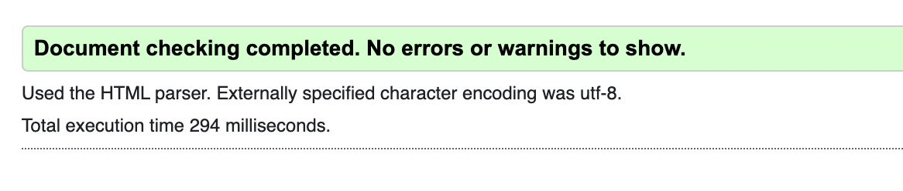

# Testing 

## Table of Contents:
1. [**Manual testing**](#manual-testing)
    * [***User stories***](#user-stories)
1. [**Validator testing**](#validator-testing)
1. [**Lighthouse testing**](#lighthouse-testing)
    * [***Landing page***](#landing-page)
    * [***Menu***](#menu)
    * [***Booking form***](#booking-form)
    * [***Booking success***](#booking-success)
    * [***Profile***](#profile)
    * [***Edit account details***](#edit-account-details)
    * [***Delete account***](#delete-account)
    * [***Edit booking***](#edit-booking)
    * [***Delete booking***](#delete-booking)
1. [**Wave accessibility evaluation**](#wave-accessibility-evaluation)
1. [**Bugs**](#bugs)
    * [***Unfixed Bugs***](#unfixed-bugs)

## Manual testing
I manually tested this site in multiple ways highlighted below:
* I tested every feature and its functionality as highlighted below in the [user stories](#user-stories).
* I deployed the site in an early stage on Heroku to make sure everything was working as intended. 
* I received invaluable feedback from my mentor David, students in my community, family members and friends working in the industry.
* I tested the site for cross-compatibility in the two most used browsers, Chrome and Safari.
* I used DevTools to easily move between different screen sizes, simulating sizes between 390px to 4000px (but it is also functional on even larger screens given the max-width setting on the Body element to keep the content compact instead of stretched).

### User stories

#### EPIC - View Products

|passed | Access a live url so that I can use the site on any device.
|:---:|:---|
|&check;|

As a shopper I can view all site products so that I can purchase them

- Acceptance Criteria
    * Access the products from the first page or navigation bar

    * All products listed on the page

    * Products listed with price, image and rating

    * Click products for more details and to purchase

As a shopper I can view all categories of products so that I can purchase specific items based on my needs

- Acceptance Criteria
    * All categories highlighted on home page and navigation bar

    * See a list of products based on category

    * Able to identify on each product what category it is

As a shopper I can view every products details on a separate page so that I can find more information and select them to purchase

- Acceptance Criteria
    * Click on each product to view the products details

    * Product details including price, rating, description, images and sizes where applicable

    * Able to select quantity to purchase and add it to bag

#### EPIC - Register and User profile

As a site user I can create an account so that I can have a personal account

- Acceptance Criteria
    * Register for an account on the site with my details

    * Receive an email confirmation after registering

    * Have a personal profile

As a site user I can login/logout out of my account so that I can access my account

- Acceptance Criteria
    * Login/logout from the navigation bar

    * Recover my password

    * Get access to my personal profile

As a site user I can access a personal user profile so that I can view my orders and personal details

- Acceptance Criteria
    * Personalized profile with delivery details, order history and wishlist

    * Update delivery details from profile

    * Able to save delivery details to my profile when checking out

    * List of user orders and link to order confirmation

As a site user I can save products to my wishlist on my profile so that I can save products that I would like to buy

- Acceptance Criteria
    * Able to save a product from the products list

    * Access the wishlist on my profile

    * List of the products I have saved

#### EPIC - Search and sort 

As a shopper I can search for products so that I can easily find what I'm looking for

- Acceptance Criteria
    * Search option in navigation bar

    * Search based on name, description or category

    * See how many products are available and what I've searched for

As a shopper I can sort the products so that I can quickly identify what I'm looking for

- Acceptance Criteria
    * Sorting option on products page

    * Sort based on name, price, rating and category

    * See how many products are available

#### EPIC - Shopping bag and checkout

As a shopper I can view my shopping bag so that I can ensure I make the correct order

- Acceptance Criteria
    * View shopping bag in navigation bar

    * See total price of the items selected on icon

    * Click shopping bag and get a full view of my items

As a shopper I can edit/delete my order in the shopping bag so that I can purchase what I want

- Acceptance Criteria
    * View all items in my shopping bag with their details

    * See total price of all items

    * Add/remove items from my bag

As a shopper I can make an order purchase so that I can buy the items I want safely

- Acceptance Criteria
    * Checkout by entering my personal details, payment information and billing details

    * See delivery information (free delivery or delivery fee)

    * Make a card transaction

    * My personal and payment information is safe and secure

As a shopper I can receive an order confirmation after checkout so that I know my order has been processed

- Acceptance Criteria
    * View an order confirmation with all my order details after checkout

    * Receive an email of my order confirmation

    * Able to contact the store if something is not correct with my order

#### EPIC - Admin management

As an admin I can edit/delete products from the site so that I have control over the store inventory

- Acceptance Criteria
    * Access product information

    * Edit product information

    * Delete products

As an admin I can add products to the site so that I can add relevant inventory

- Acceptance Criteria
    * Admin access to site with admin profile

    * Add more products to the site

    * Input images, price, description and necessary product information

#### EPIC - Contact

As a shopper I can contact the store so that I can communicate with the store about orders, products or whatever I might need to make a purchase

- Acceptance Criteria
    * Contact form on the website

    * Input details and message for the store

    * Form submission to admin panel

#### EPIC - Review

As a shopper I can add a review on the products so that I can share my opinions about the products

- Acceptance Criteria
    * Able to add a review on the product details page

    * Include a name, date of review and review

    * Possible to see how many reviews exist

## Validator testing 

- HTML
  - There were no errors present when passing through the official W3C validator 

- CSS
  - There were no errors present when passing through the official Jigsaw validator with direct input 

- PEP8
  - There were no errors present when passing through the PEP8 CI Python linter 

## Lighthouse testing 

This testing was done in an incognito window in Chrome to make sure the results were not influenced by browser extensions.

The lower scores were for two main reasons:
- The cdn imports from bootstrap, Google fonts and Font Awesome.
- Hero image and background image, which were compressed and even resized multiple times without a change in score. It was not possible to edit them further without a bigger change in quality.

### **Landing page**
- Desktop version:

- Mobile version:

### **Menu**

- Desktop version:

- Mobile version:

### **Booking form**

- Desktop version:

- Mobile version:

### **Booking success**

- Desktop version:

- Mobile version:

### **Profile**

- Desktop version:

- Mobile version:

### **Edit account details**

- Desktop version:

- Mobile version:

### **Delete account**

- Desktop version:

- Mobile version:

### **Edit booking**

- Desktop version:

- Mobile version:

### **Delete booking**

- Desktop version:

- Mobile version:

## Wave accessibility evaluation

I also used the Wave evaluation tool to make sure I covered all my bases. 
The evaluation is free from errors on all pages.

## Bugs

See more feature related bugs in the [user story section](#user-stories).

- 
    - 

### Unfixed Bugs
- This might be more of an unfixed feature but when the logged in user adds a product to their wishlist, a JSON response message pops up instead of a toast message. I tried adding the toast messages too but they did not display properly so given the time constraint of the deadline, I decided to remove them completely and keep the JSON messages for now.
This would of course be one of the first things I would change with more time, so as to keep the messages cohesive across the site.

- The reset functionality on the sorting box when clicking 'Sort By' was not working properly so I had to abandon that last minute but I plan on fixing it when coming back to the project as well.