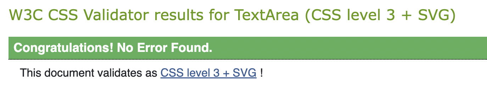

# Testing 

## Table of Contents:
1. [**Manual testing**](#manual-testing)
    * [***User stories***](#user-stories)
        * [***EPIC - View Products***](#epic---view-products)
        * [***EPIC - Register and User profile***](#epic---register-and-user-profile)
        * [***EPIC - Search and Sort***](#epic---search-and-sort)
        * [***EPIC - Shopping bag and Checkout***](#epic---shopping-bag-and-checkout)
        * [***EPIC - Admin Management***](#epic---admin-management)
        * [***EPIC - Contact***](#epic---contact)
        * [***Footer***](#footer)
1. [**Validator testing**](#validator-testing)
1. [**Lighthouse testing**](#lighthouse-testing)
    * [***Landing page***](#landing-page)
   

1. [**Wave accessibility evaluation**](#wave-accessibility-evaluation)
1. [**Bugs**](#bugs)
    * [***Unfixed Bugs***](#unfixed-bugs)

## Manual testing
I manually tested this site in multiple ways highlighted below:
* I tested every feature and its functionality as highlighted below in the [user stories](#user-stories).
* I deployed the site in an early stage on Heroku to make sure everything was working as intended. 
* I received invaluable feedback from my mentor David, students in my community, family members and friends working in the industry.
* I tested the site for cross-compatibility in the two most used browsers, Chrome and Safari.
* I used DevTools to easily move between different screen sizes, simulating sizes between 390px to 4000px (but it is also functional on even larger screens given the max-width setting on the Body element to keep the content compact instead of stretched).

### User stories

#### EPIC - View Products

|passed | **View all site products so that I can purchase them**
|:---:|:---|
|&check;| List of all products on the Products page
|&check;| Navigation to Products from navigation bar
|&check;| Navigation to Products from landing page
|&check;| Products displayed with name, price, image, category and introduction
|&check;| Able to click on products to get to the Product Details page
|&check;| Back to top button exists to simplify page scrolling
|&check;| Number of products displayed on the page is highlighted

|passed | **View all categories of products so that I can purchase specific items based on my needs**
|:---:|:---|
|&check;| All categories highlighted in navigation bar
|&check;| All categories highlighted on Products page under title
|&check;| Every category button/link displays the list of products in that category
|&check;| Each product has a category tag
|&check;| The category tag displays the list of products in that category

|passed | **View every products details on a separate page so that I can find more information and select them to purchase**
|:---:|:---|
|&check;| Click on a product from Products page to get to Product Details page
|&check;| The page contains all details, price, image, name, introduction, category tag and description
|&check;| Can only select quantity between 1-99 of product to add to shopping bag
|&check;| Error displays if value is incorrect
|&check;| Quantity buttons disable at min/max value
|&check;| Add to bag button adds product to the shopping bag
|&check;| Success message displays shopping bag summary with added products and details
|&check;| Continue Shopping button directs back to Products page

|passed | **Add a review on the products so that I can share my opinions about the products**
|:---:|:---|
|&check;| Any shopper/site user can submit a review on the Product Details page
|&check;| Review displays after submitting with name, review and time 
|&check;| Overflow property sets the review container to scroll
|&check;| Review count updates correctly after each added review (as well as after being deleted in the admin panel)
|&check;| Reviews featured in the admin panel for edit/delete purposes

#### EPIC - Register and User profile

|passed | **Create an account so that I can have a personal account on the site**
|:---:|:---|
|&check;| Register page highlighted in the navigation bar
|&check;| Functioning Allauth authorization page (with error messages if incorrect values are added)
|&check;| Receive email confirmation through Gmail to verify the email
|&check;| Functioning Confirm email link and page
|&check;| Personal user profile is created and accessible from the navigation bar

|passed | **Sign In/Sign Out out of my account so that I can access my account**
|:---:|:---|
|&check;| Sign In/Sign Out pages highlighted in the navigation bar
|&check;| Functioning Allauth authorization pages (with error messages if incorrect values are added)
|&check;| Recover password works and a link to reset password is on the sign in page
|&check;| Access to personal user profile with my details from the navigation bar when logged in

|passed | **View all site products so that I can purchase them**
|:---:|:---|
|&check;| Access to Profile from navigation bar
|&check;| Error message if admin tries to access the profile and redirect to sign in page if non-logged in user tries
|&check;| Functioning tabs for each profile section
|&check;| User's delivery details are correctly displayed (or set to None if they haven't added them yet)
|&check;| Update delivery details form works and updates the details properly after submitting
|&check;| Delivery details saved from the checkout displays properly
|&check;| Order history tab contains all user's orders
|&check;| Correctly displays the user order details
|&check;| Order number links back to the order confirmation (checkout success)
|&check;| Displays 'You have no orders' if no orders have been made
|&check;| Continue shopping button directs to Products page

|passed | **Save products to my wishlist on my profile so that I can save products that I would like to buy**
|:---:|:---|
|&check;| Button to Save to Wishlist displays with logged in users (and not admin)
|&check;| Save to Wishlist button on the Products page under each product
|&check;| With each click, product is either added or removed from the user's wishlist and JSON success response message displays
|&check;| If any issues, JSON response displays an error message
|&check;| Access to Wishlist on the user profile
|&check;| Products displayed as on the Products page (with price, name, introduction and category tag)
|&check;| Sort box to sort products by name, price and category
|&check;| Remove from wishlist button under each product that removes the product
|&check;| Product count functioning and updates with addition or removal from wishlist 
|&check;| Link to All Products

#### EPIC - Search and sort 

|passed | **Search for products so that I can easily find what I'm looking for**
|:---:|:---|
|&check;| Search option in navigation bar
|&check;| Search based on name, description or category
|&check;| Displays list of products that match
|&check;| Product count displayed with the search term used
|&check;| All Products link
|&check;| Sort box to sort by name, price and category

|passed | **Sort the products so that I can quickly identify what I'm looking for**
|:---:|:---|
|&check;| Sort box displayed on all pages with products (Products page, Category pages, Wishlist)
|&check;| Sort products based on name, price and category
|&check;| Displays product count and all products link

#### EPIC - Shopping bag and checkout

|passed | **View shopping bag so that I can ensure I make the correct order**
|:---:|:---|
|&check;| View shopping bag icon in navigation bar
|&check;| See total price of the items selected on icon
|&check;| Shopping bag preview displays in success message after adding product to bag
|&check;| Secure checkout button in preview to go to shopping page
|&check;| If order total is below $100, a banner highlights amount left until free delivery
|&check;| Click shopping bag to be directed to shopping bag page

|passed | **Edit/delete my order in the shopping bag so that I can purchase what I want**
|:---:|:---|
|&check;| View all items in my shopping bag with name, image, SKU, quantity and subtotal
|&check;| Can only select quantity between 1-99 of product
|&check;| Error message display of incorrect value
|&check;| Quantity buttons disable at min/max value
|&check;| Remove button removes the product from the shopping bag
|&check;| Update button updates the quantity when changed
|&check;| Bag total, delivery total and grand total displays correctly
|&check;| Continue shopping button directs to all products
|&check;| Secure checkout button directs to checkout page

|passed | **Make an order purchase so that I can buy the items I want safely**
|:---:|:---|
|&check;| Order summary displayed on checkout page with shopping bag details (product, quantity and grand total)
|&check;| Personal details and delivery details form
|&check;| Forms are pre-populated if logged in user (and saved delivery details)
|&check;| Checkbox to save delivery details for logged in users
|&check;| Functioning secure Stripe payment with webhooks set up
|&check;| Adjust bag button to go back to the shopping bag
|&check;| Complete order button to checkout

|passed | **Receive an order confirmation after checkout so that I know my order has been processed**
|:---:|:---|
|&check;| Redirect to order confirmation after successful checkout
|&check;| Receive order confirmation email through Gmail
|&check;| View the order confirmation page with all order details 
|&check;| Contact button to redirect to contact form

#### EPIC - Admin management

|passed | **Edit/delete products from the site so that I have control over the store inventory**
|:---:|:---|
|&check;| Admin access to the site with superuser log in
|&check;| Edit button on Product details page only visible to admin
|&check;| Edit button links to Edit Product page with pre-populated form to update product details (includes Summernote editor)
|&check;| Details are immediately updated when submitted
|&check;| Delete button on Product details page only visible to admin
|&check;| Delete button links to Delete product page with a delete confirmation 
|&check;| Displays product name and image 
|&check;| Red delete button to delete the product and gray cancel button to go back to Product details page

|passed | **Add products to the site so that I can add relevant inventory**
|:---:|:---|
|&check;| Admin access to the site with superuser log in
|&check;| My account dropdown features Add Product page (only visible to admin)
|&check;| Add Product form (includes Summernote editor) to input name, category, image, price, description, introduction and SKU
|&check;| Product is immediately uploaded to the site after submitting

#### EPIC - Contact

|passed | **Contact the store so that I can communicate with the store about orders, products or whatever I might need to make a purchase**
|:---:|:---|
|&check;| Contact form for all site users, featured in My Account dropdown in navigation bar
|&check;| Form includes name, email, subject, order number (if applicable) and message
|&check;| Form submission to admin panel
|&check;| All contact messages are visible in the admin panel

### Footer 

|passed | **Sign up to the store newsletter and get quick access to the contact form so that I can stay connected to the brand**
|:---:|:---|
|&check;| Mailchimp email subscribing for marketing newsletter
|&check;| Subscription confirmation
|&check;| Contact button directs to the contact form
|&check;| Functioning Facebook link to real Lohana profile

## Validator testing 

- HTML
  - There were no errors present when passing through the official W3C validator 

- CSS
  - There were no errors present when passing through the official Jigsaw validator with direct input 

- PEP8
  - There were no errors present when passing through the PEP8 CI Python linter 

## Lighthouse testing 

This testing was done in an incognito window in Chrome to make sure the results were not influenced by browser extensions.

The lower scores were for two main reasons:
- The cdn imports from bootstrap, Google fonts and Font Awesome.
- Hero image and background image, which were compressed and even resized multiple times without a change in score. It was not possible to edit them further without a bigger change in quality.

### **Landing page**
- Desktop version:

- Mobile version:

### **Register**

- Desktop version:

- Mobile version:

### **Sign in**

- Desktop version:

- Mobile version:

### **Sign Out**

- Desktop version:

- Mobile version:

### **Products**

The performance of the category selected pages were the same scores as below.

- Desktop version:

- Mobile version:

### **User Profile - Delivery Details**

- Desktop version:

- Mobile version:

### **User Profile - Order History**

- Desktop version:

- Mobile version:

### **User Profile - Wishlist**

- Desktop version:

- Mobile version:

### **Admin - Add product**

- Desktop version:

- Mobile version:

### **Admin - Edit Product**

- Desktop version:

- Mobile version:

### **Admin - Delete Product**

- Desktop version:

- Mobile version:

### **Contact form**

- Desktop version:

- Mobile version:

### **Contact Success**

- Desktop version:

- Mobile version:

### **Shopping Bag**

- Desktop version:

- Mobile version:

### **Checkout**

- Desktop version:

- Mobile version:

### **Checkout Success**

- Desktop version:

- Mobile version:

## Wave accessibility evaluation

I also used the Wave evaluation tool to make sure I covered all my bases. 
The evaluation is free from errors on all pages.

## Bugs

- Summernote editor for description field in Product model is not updating after set up.
    - Update ProductAdmin function from admin.ModelAdmin to SummernoteModelAdmin and add summernote_fields.

- Summernote fields text is displaying as raw HTML content.
    - Add “|safe” to the HTML tag.

- The superuser can access the user profile.
    - Add if statement in the profile view to handle superuser access.

- After adding the title tag for the products page, when clicking 'All Products' it displays 'Necklaces'.
    - Add if statement to check if the length of the categories selected match the count of the Category model (the template tag includes all categories).

- Category sorting is not working with sorting box on products page.
    - Change elif statement from “order_by(‘category’)” to “order_by(‘category__name’)”.
- Toast messages disappear after 1 second instead of staying on the page.
    - Add autohide attribute in JS code.

- Grand total is not displaying correctly in the admin panel on created orders.
    - Update the model method to calculate the grand_total as the sum of the delivery cost and order total.

- Migration fail after changing the Country model field to Django Countries (**Error: value too long for type character varying(2)**).
    - Migration file stored the Country field as 'Max_length=2' so I updated the max_length to 255 in the file and migrated again.

- User profile tab content being pushed down by the first tab content, the first tab content is not disappearing.
    - The d-flex class on the Delivery Details content pushed the other content down. Added JS code to add/remove the d-flex class depending on the tab that is clicked.

- After adding a product to the site with the Add Product page and then removing the product from the admin panel, returned a site-wide error (**“Page not found (404) No Product matches the given query.”**).
    - Add if statement in bag_contents context processor to only query the Product model when necessary.

- Error (***clean() got an unexpected keyword argument 'styles’**) when trying to submit new details on the Edit Products page after adding Summernote.
    - Download Bleach. ([Help from StackOverflow](https://stackoverflow.com/questions/73789407/django-summernote-clean-got-an-unexpected-keyword-argument-styles-in-djangof))

- Heroku deployment error when setting up Django-storages (**An error occurred (403) when calling the HeadObject operation: Forbidden**).
    - After hours of troubleshooting, I removed AWS and opted for Whitenoise and Cloudinary to handle my static and media files.

- Register/Login error with new users (**SMTP.starttls() got an unexpected keyword argument 'keyfile’**).
    - Update to Django 4.2.7 and allauth0.61.0, [Help from StackOverflow](https://stackoverflow.com/questions/77482831/smtp-starttls-got-an-unexpected-keyword-argument-keyfile).

- Error with add_to_wishlist view when using Ajax (after new Django and Allauth installs perhaps?) (**AttributeError: 'WSGIRequest' object has no attribute 'is_ajax’**).
    - Updated 'is_ajax' to "request.headers.get('x-requested-with') == 'XMLHttpRequest'", [Help from StackOverflow](https://stackoverflow.com/questions/70419441/attributeerror-wsgirequest-object-has-no-attribute-is-ajax).

- Error when checking out with Stripe (**NameError - payment.intent.succeeded = 500 server error**).
    - import stripe at the top of webhooks, OOPS!

- Emails are not sending on Heroku deployed site, only in the local environment.
    - I had set the ‘DEVELOPMENT’ variable in Heroku's Config var to False. I removed it and everything was fine of course.

### Unfixed Bugs
- This might be more of an unfixed feature but when the logged in user adds a product to their wishlist, a JSON response message pops up instead of a toast message. I tried adding the toast messages too but they did not display properly so given the time constraint of the deadline, I decided to remove them completely and keep the JSON messages for now.
This would of course be one of the first things I would change with more time, so as to keep the messages cohesive across the site.

- The reset functionality on the sorting box when clicking 'Sort By' was not working properly so I had to abandon that last minute but I plan on fixing it when coming back to the project as well.

- When going to the Products page directly from the [URL](https://lohana-df1411a79e72.herokuapp.com/products/) and not one of the buttons on the page, the page displays without the categories under the title (and without the categories in the URL). This was noticed in the final moments before the deadline of course...